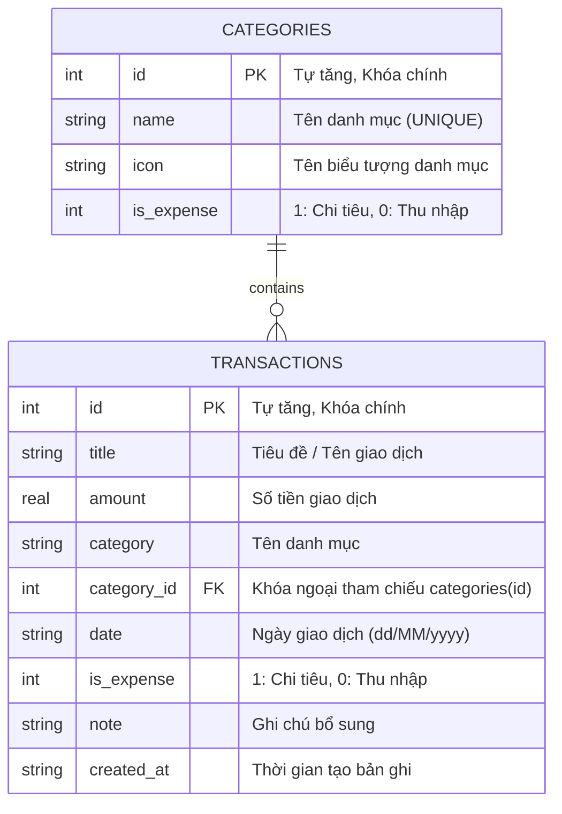

# BÁO CÁO THIẾT KẾ VÀ XÂY DỰNG CƠ SỞ DỮ LIỆU SQLITE (BUỔI 5)

**Dự án:** Expense Manager (Ứng dụng Quản lý thu chi cá nhân)  
**Học phần:** Case Study 1 - Lập trình ứng dụng di động với Flutter  
**Sinh viên thực hiện:** Trần Phú Danh  
**Mã số sinh viên:** KHMT2411012  
**Mục tiêu Buổi 5:** Thiết kế và xây dựng cơ sở dữ liệu cho ứng dụng bằng SQLite  

---

## 1. TỔNG QUAN KIẾN TRÚC CƠ SỞ DỮ LIỆU

Ứng dụng sử dụng hệ quản trị cơ sở dữ liệu nhúng **SQLite** thông qua thư viện `sqflite` và `path` trên nền tảng Flutter. SQLite hoạt động độc lập ngay trên thiết bị của người dùng, đảm bảo tính riêng tư, tốc độ truy xuất cực nhanh và khả năng hoạt động offline mà không phụ thuộc vào internet.

- **Tên cơ sở dữ liệu:** `expense_manager.db`
- **Phiên bản (Version):** `1`
- **Mô hình lập trình:** Singleton Pattern (`DatabaseHelper.instance`) đảm bảo chỉ có duy nhất một kết nối database được mở trong suốt vòng đời ứng dụng.
- **Ràng buộc khóa ngoại:** Kích hoạt `PRAGMA foreign_keys = ON` để đảm bảo tính toàn vẹn dữ liệu quan hệ.

---

## 2. SƠ ĐỒ THỰC THỂ QUAN HỆ (ERD - ENTITY RELATIONSHIP DIAGRAM)

Cơ sở dữ liệu bao gồm 2 thực thể chính có mối quan hệ **1 - N (Một - Nhiều)**:
- Một danh mục (`categories`) có thể chứa nhiều giao dịch (`transactions`).
- Mỗi giao dịch (`transactions`) liên kết với một danh mục tương ứng thông qua khóa ngoại `category_id`.



---

## 3. ĐẶC TẢ CHI TIẾT CÁC BẢNG DỮ LIỆU (DATA DICTIONARY)

### 3.1. Bảng `categories` (Danh mục giao dịch)

| Tên trường | Kiểu dữ liệu | Ràng buộc | Ý nghĩa |
| :--- | :--- | :--- | :--- |
| `id` | `INTEGER` | `PRIMARY KEY AUTOINCREMENT` | Mã định danh danh mục (duy nhất) |
| `name` | `TEXT` | `NOT NULL UNIQUE` | Tên danh mục (Ăn uống, Di chuyển, Lương,...) |
| `icon` | `TEXT` | `NOT NULL` | Tên icon đại diện danh mục |
| `is_expense` | `INTEGER` | `NOT NULL` | `1`: Danh mục chi tiêu, `0`: Danh mục thu nhập |

### 3.2. Bảng `transactions` (Giao dịch thu chi)

| Tên trường | Kiểu dữ liệu | Ràng buộc | Ý nghĩa |
| :--- | :--- | :--- | :--- |
| `id` | `INTEGER` | `PRIMARY KEY AUTOINCREMENT` | Mã định danh giao dịch |
| `title` | `TEXT` | `NOT NULL` | Tên hoặc mô tả ngắn của giao dịch |
| `amount` | `REAL` | `NOT NULL` | Số tiền giao dịch (VNĐ) |
| `category` | `TEXT` | `NOT NULL` | Tên danh mục phục vụ truy vấn nhanh |
| `category_id` | `INTEGER` | `FOREIGN KEY` | Khóa ngoại trỏ đến `categories(id)` |
| `date` | `TEXT` | `NOT NULL` | Ngày thực hiện giao dịch (`dd/MM/yyyy`) |
| `is_expense` | `INTEGER` | `NOT NULL` | `1`: Chi tiêu (Khoản trừ), `0`: Thu nhập (Khoản cộng) |
| `note` | `TEXT` | `NULL` | Ghi chú thêm cho giao dịch |
| `created_at` | `TEXT` | `NULL` | Thời gian tạo giao dịch (ISO-8601) |

---

## 4. KỊCH BẢN SQL (SQL SCRIPTS)

### 4.1. Kịch bản DDL (Data Definition Language) - Tạo bảng

```sql
-- 1. Bật ràng buộc khóa ngoại
PRAGMA foreign_keys = ON;

-- 2. Tạo bảng danh mục
CREATE TABLE categories (
    id INTEGER PRIMARY KEY AUTOINCREMENT,
    name TEXT NOT NULL UNIQUE,
    icon TEXT NOT NULL,
    is_expense INTEGER NOT NULL
);

-- 3. Tạo bảng giao dịch
CREATE TABLE transactions (
    id INTEGER PRIMARY KEY AUTOINCREMENT,
    title TEXT NOT NULL,
    amount REAL NOT NULL,
    category TEXT NOT NULL,
    category_id INTEGER,
    date TEXT NOT NULL,
    is_expense INTEGER NOT NULL,
    note TEXT,
    created_at TEXT,
    FOREIGN KEY (category_id) REFERENCES categories (id) ON DELETE SET NULL
);
```

### 4.2. Kịch bản DML (Data Manipulation Language) - Thao tác CRUD & Thống kê

#### Thêm mới (Create):
```sql
-- Thêm danh mục
INSERT INTO categories (name, icon, is_expense) 
VALUES ('Ăn uống', 'restaurant', 1);

-- Thêm giao dịch chi tiêu
INSERT INTO transactions (title, amount, category, category_id, date, is_expense, note, created_at)
VALUES ('Ăn trưa', 50000.0, 'Ăn uống', 1, '03/09/2024', 1, 'Ăn trưa cùng bạn', datetime('now'));

-- Thêm giao dịch thu nhập
INSERT INTO transactions (title, amount, category, category_id, date, is_expense, note, created_at)
VALUES ('Lương tháng 9', 8000000.0, 'Thu nhập', 7, '01/09/2024', 0, 'Chuyển khoản lương', datetime('now'));
```

#### Truy vấn (Read):
```sql
-- Lấy tất cả giao dịch mới nhất lên đầu
SELECT * FROM transactions ORDER BY id DESC;

-- Lấy 5 giao dịch gần đây cho Dashboard
SELECT * FROM transactions ORDER BY id DESC LIMIT 5;

-- Lấy giao dịch theo ID
SELECT * FROM transactions WHERE id = ?;
```

#### Cập nhật (Update):
```sql
UPDATE transactions 
SET title = ?, amount = ?, category = ?, date = ?, is_expense = ?, note = ?
WHERE id = ?;
```

#### Xóa (Delete):
```sql
DELETE FROM transactions WHERE id = ?;
```

#### Tổng hợp & Thống kê (Aggregate Queries):
```sql
-- Tổng thu nhập
SELECT SUM(amount) AS total FROM transactions WHERE is_expense = 0;

-- Tổng chi tiêu
SELECT SUM(amount) AS total FROM transactions WHERE is_expense = 1;

-- Thống kê chi tiêu theo từng danh mục
SELECT category, SUM(amount) AS total
FROM transactions
WHERE is_expense = 1
GROUP BY category
ORDER BY total DESC;
```

---

## 5. CẤU TRÚC MÃ NGUỒN DỰ ÁN

```
f:\test1111\
├── lib\
│   ├── database\
│   │   └── database_helper.dart      # Singleton quản lý kết nối SQLite, DDL, CRUD & Aggregate queries
│   ├── models\
│   │   ├── category_model.dart       # Model thực thể Category (toMap, fromMap, copyWith)
│   │   └── transaction_model.dart    # Model thực thể Transaction (toMap, fromMap, copyWith)
│   └── main.dart                     # Ứng dụng Flutter: WelcomeScreen, DashboardScreen, AddScreen, EditScreen
├── test\
│   ├── database_test.dart            # Bộ 8 Unit Tests kiểm thử toàn bộ CSDL SQLite & Models
│   └── widget_test.dart              # Kiểm thử giao diện WelcomeScreen
├── DATABASE_DESIGN.md                # Tài liệu thiết kế CSDL SQLite (báo cáo lý thuyết Buổi 5)
├── pubspec.yaml                      # Khai báo dependency sqflite, path, sqflite_common_ffi
└── README.md                         # Giới thiệu tổng quan đồ án và các buổi học
```

---

## 6. KẾT QUẢ KIỂM THỬ

- **Kiểm thử tự động:** Đã xây dựng bộ unit test hoàn chỉnh trong `test/database_test.dart`.
- **Kết quả:** `All tests passed! (8/8 tests passed)`.
- **Phân tích mã nguồn:** `flutter analyze` đạt tiêu chuẩn sạch `No issues found!`.
- **Hoạt động thực tế:**
  - Dữ liệu thêm/sửa/xóa được đồng bộ ngay tức thì với cơ sở dữ liệu SQLite.
  - Số dư, tổng thu, tổng chi và biểu đồ tỷ lệ chi tiêu tự động tính toán lại khi có biến động dữ liệu.
